# Performance Testing and Profiling

## Endpoint `/all-student`

**JMeter (GUI)**

**JMeter (CLI)**
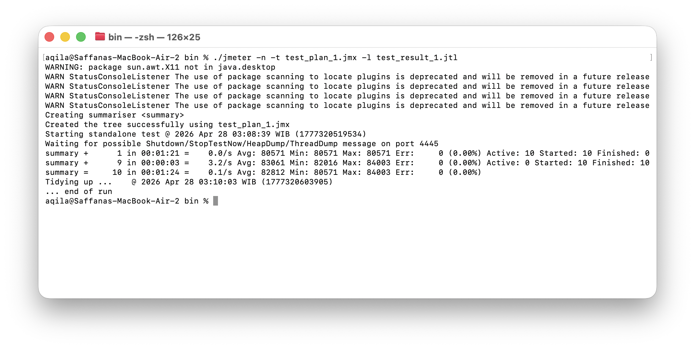
- Before Optimizing: Average Response Time = 82812 ms
  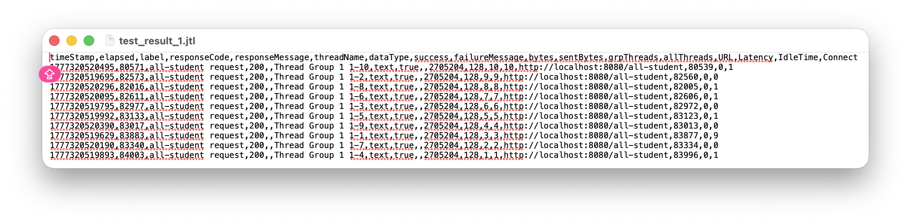
- After Optimizing: Average Response Time = 712 ms
  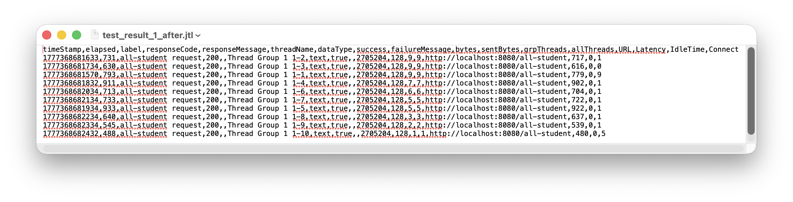
- Improvement: ~99.1% faster

**IntelliJ Profiler (Before Optimizing vs After Optimizing)**
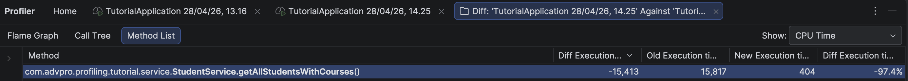

## Endpoint `/all-student-name`

**JMeter (GUI)**
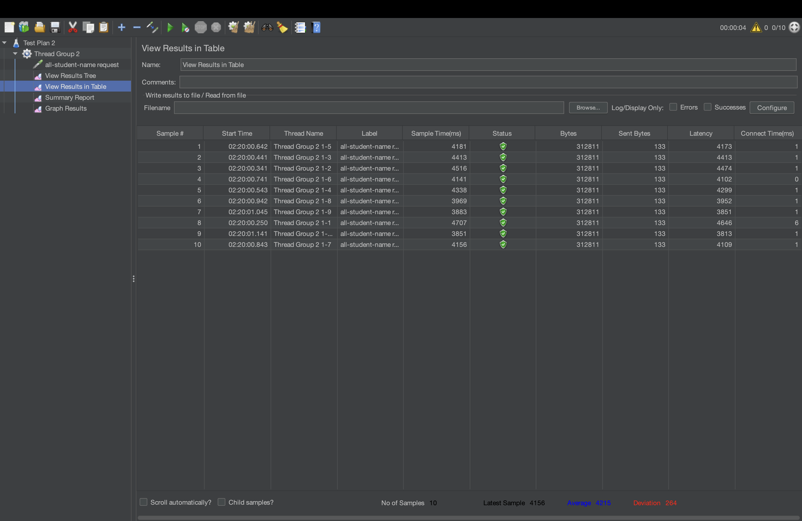

**JMeter (CLI)**
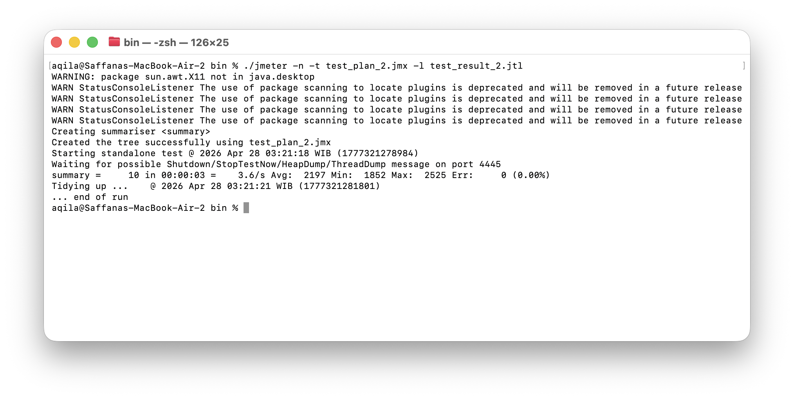
- Before Optimizing: Average Response Time = 2197 ms
  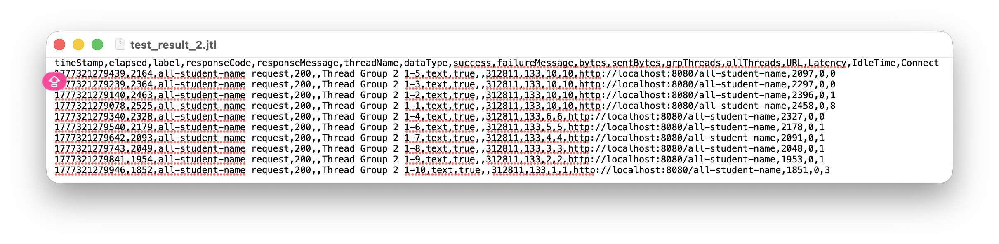
- After Optimizing: Average Response Time = 32 ms
  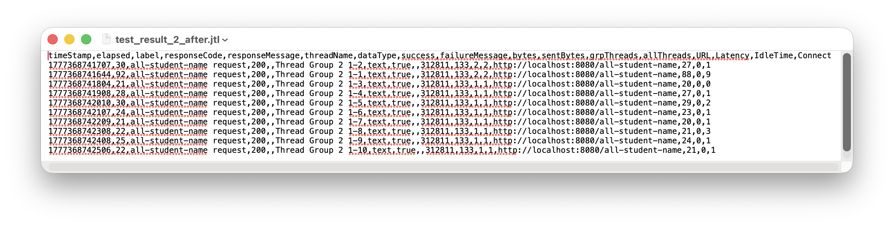
- Improvement: ~98.5% faster

**IntelliJ Profiler (Before Optimizing vs After Optimizing)**
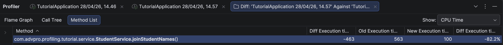

## Endpoint `/highest-gpa`

**JMeter (GUI)**
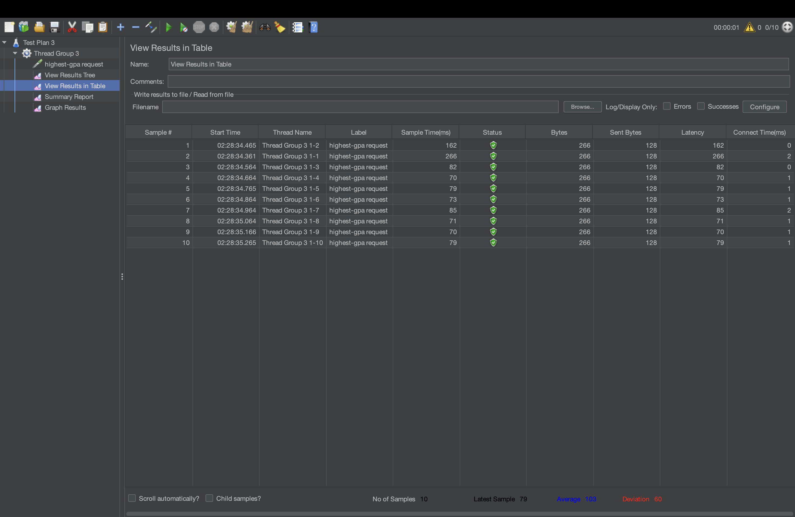

**JMeter (CLI)**

- Before Optimizing: Average Response Time = 139 ms
  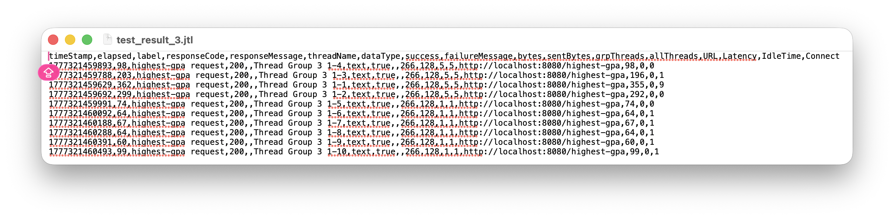
- After Optimizing: Average Response Time = 23 ms
  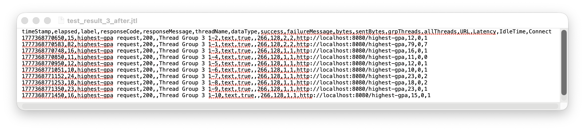
- Improvement: ~83.5% faster

**IntelliJ Profiler (Before Optimizing vs After Optimizing)**
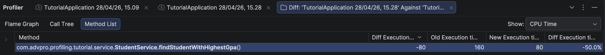

## Reflection
### 1. What is the difference between the approach of performance testing with JMeter and profiling with IntelliJ Profiler in the context of optimizing application performance?
JMeter measures application performance from the **client's perspective**. It simulates multiple users sending requests and records metrics like response time, telling us *how slow* the application is. IntelliJ Profiler, on the other hand, analyzes performance from the **server's perspective**. It inspects method-level CPU time and call stacks, telling us *why* the application is slow. In the context of optimization, JMeter identifies *which* endpoints have performance issues, while IntelliJ Profiler pinpoints *which specific methods* in the code are responsible for those issues.

### 2. How does the profiling process help you in identifying and understanding the weak points in your application?
Profiling provides me a detailed breakdown of CPU time per method, visualized through the Flame Graph, Method List, and many more. In this exercise, profiling revealed that `getAllStudentsWithCourses()` consumed the most CPU time (~15,817 ms) due to the N+1 problem, where 20,001 separate database queries were executed instead of one. Without profiling, this bottleneck would have been difficult to pinpoint just by reading the code or looking at JMeter results alone.

### 3. Do you think IntelliJ Profiler is effective in assisting you to analyze and identify bottlenecks in your application code?
Yes, especially its ability to break down CPU time at the method level through the Method List. I could immediately see which methods consumed the most resources and prioritize accordingly. In this exercise, it directly pointed me to `getAllStudentsWithCourses()`, `joinStudentNames()`, and `findStudentWithHighestGpa()` as the main bottlenecks, all of which I successfully optimized as a result.

### 4. What are the main challenges you face when conducting performance testing and profiling, and how do you overcome these challenges?
The main challenge was **inconsistent measurements** due to JVM warm-up behavior. I overcome this by "warming up" the application (start the application, hit the endpoint, turn off the application, start again) several times, as recommended in the module.

### 5. What are the main benefits you gain from using IntelliJ Profiler for profiling your application code?
1. **Precision**: Identifies the exact method causing the bottleneck
2. **Visualization**: Flame Graph makes it intuitive to see resource-heavy methods at a glance
3. **CPU Time vs Total Time**: Distinguishes between actual CPU processing time and waiting time, giving me a more accurate picture of code efficiency
4. **Comparison View**: Allows side-by-side comparison of profiling sessions before and after optimization, making it easy for me to verify improvements

### 6. How do you handle situations where the results from profiling with IntelliJ Profiler are not entirely consistent with findings from performance testing using JMeter?
JMeter and IntelliJ Profiler measure different things, so some inconsistency is expected and normal. But, still, when inconsistencies arise, I look at the overall trend. If JMeter shows a faster response time and the Profiler confirms a drop in CPU time, I am confident the optimization worked. But, if the two genuinely contradict each other, I verify that both measurements were taken under the same conditions and check whether something outside the code, like network latency, is skewing the results.

### 7. What strategies do you implement in optimizing application code after analyzing results from performance testing and profiling? How do you ensure the changes you make do not affect the application's functionality?
The optimization strategy applied in this exercise was:
1. Always let the profiler identify the bottleneck
2. Fix the root cause. For `/all-student`, the N+1 problem was fixed using `JOIN FETCH`; for `/all-student-name`, inefficient String concatenation was replaced with `String.join()`; for `/highest-gpa`, a full table scan was replaced with `findTopByOrderByGpaDesc()`
3. After each optimization, re-run JMeter to confirm the improvement meets the 20% threshold

To ensure functionality was not affected, the API response structure was kept identical before and after optimization, and the endpoints were manually tested via browser to confirm correct data was still returned after refactoring.
